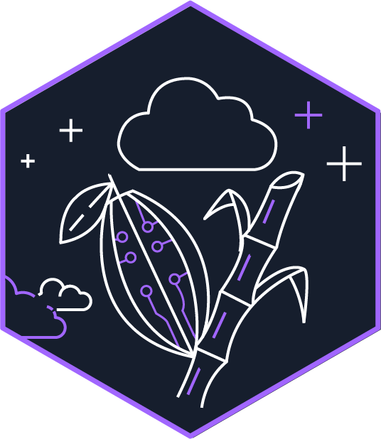
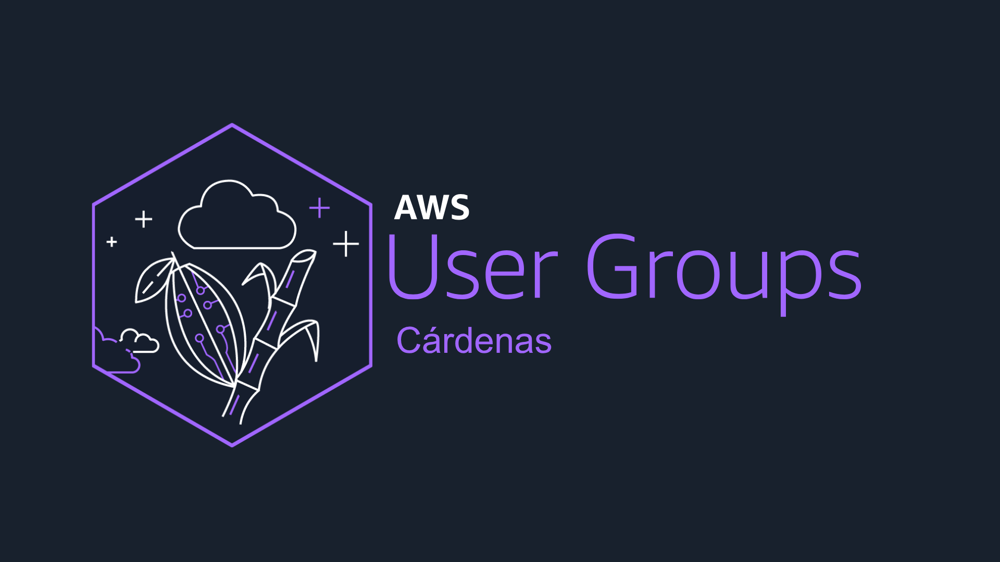

# AWS User Group Cárdenas — Sitio web

Landing page de la comunidad **AWS User Group Cárdenas**, un espacio para aprender, colaborar y crecer en torno a **Amazon Web Services** en Tabasco y la región. El diseño refleja la identidad del grupo: nube y tecnología unidas a la herencia local (cacao y caña de azúcar), con una estética oscura, morado vibrante y tipografía clara.

<p align="center">
  
</p>

<p align="center">
  
</p>

## Contenido del proyecto

- Presentación de la comunidad y propósito.
- Destacado del **evento inaugural** y enlaces a [Meetup](https://www.meetup.com/aws-ug-cardenas/).
- Sección de eventos pasados (lista editable en código).
- Perfiles de organizadores y llamados a unirse (Meetup e Instagram).

## Stack

- [Vite](https://vitejs.dev/) + [React 19](https://react.dev/) + TypeScript
- Estilos en CSS (variables de marca, sin framework de UI)
- Iconos con [Lucide React](https://lucide.dev/) y SVG propios donde aplica

## Requisitos

- Node.js 20+ recomendado
- npm

## Scripts

```bash
npm install    # Dependencias
npm run dev    # Servidor de desarrollo
npm run build  # Compilación de producción (salida en dist/)
npm run preview # Vista previa del build
npm run lint    # ESLint
```

## Datos editables

Textos enlaces, evento próximo, eventos pasados y organizadores viven en `src/data/site.ts`. Las imágenes públicas están en la carpeta `public/`.

## Licencia y marcas

La comunidad es independiente. **AWS** y **Amazon Web Services** son marcas de Amazon.com, Inc.
